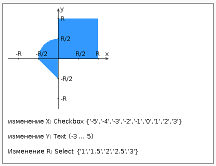
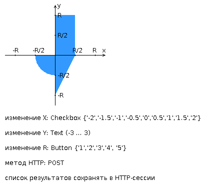
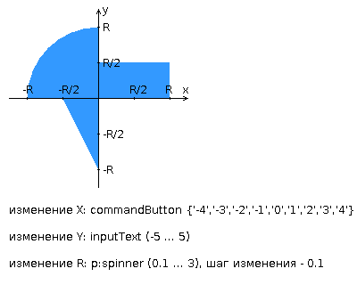
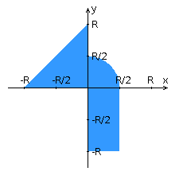

# arachnophobia

## Lab 1
Разработать PHP-скрипт, определяющий попадание точки на координатной плоскости в заданную область, и создать HTML-страницу, которая формирует данные для отправки их на обработку этому скрипту.

Параметр R и координаты точки должны передаваться скрипту посредством HTTP-запроса. Скрипт должен выполнять валидацию данных и возвращать HTML-страницу с таблицей, содержащей полученные параметры и результат вычислений - факт попадания или непопадания точки в область. Предыдущие результаты должны сохраняться между запросами и отображаться в таблице. Кроме того, ответ должен содержать данные о текущем времени и времени работы скрипта.

### Разработанная HTML-страница должна удовлетворять следующим требованиям:
- Для расположения текстовых и графических элементов необходимо использовать блочную верстку.
- Данные формы должны передаваться на обработку посредством GET-запроса.
- Таблицы стилей должны располагаться в самом веб-документе.
- При работе с CSS должно быть продемонстрировано использование селекторов классов, селекторов псевдоклассов, селекторов - элементов, селекторов потомств а также такие свойства стилей CSS, как наследование и каскадирование.
- HTML-страница должна иметь "шапку", содержащую ФИО студента, номер группы и новер варианта. При оформлении шапки необходимо - явным образом задать шрифт (sans-serif), его цвет и размер в каскадной таблице стилей.
- Отступы элементов ввода должны задаваться в процентах.
- Страница должна содержать сценарий на языке JavaScript, осуществляющий валидацию значений, вводимых пользователем в поля формы. 
- Любые некорректные значения (например, буквы в координатах точки или отрицательный радиус) должны блокироваться.



## Lab 2
Разработать веб-приложение на базе сервлетов и JSP, определяющее попадание точки на координатной плоскости в заданную область. Приложение должно быть реализовано в соответствии с шаблоном MVC и состоять из следующих элементов:
- ControllerServlet, определяющий тип запроса, и, в зависимости от того, содержит ли запрос информацию о координатах точки и радиусе, делегирующий его обработку одному из перечисленных ниже компонентов. Все запросы внутри приложения должны передаваться этому сервлету (по методу GET или POST в зависимости от варианта задания), остальные сервлеты с веб-страниц напрямую вызываться не должны.
- AreaCheckServlet, осуществляющий проверку попадания точки в область на координатной плоскости и формирующий HTML-страницу с результатами проверки. Должен обрабатывать все запросы, содержащие сведения о координатах точки и радиусе области.
- Страница JSP, формирующая HTML-страницу с веб-формой. Должна обрабатывать все запросы, не содержащие сведений о координатах точки и радиусе области.
Разработанная страница JSP должна содержать:
    1.	"Шапку", содержащую ФИО студента, номер группы и номер варианта.
    2.	Форму, отправляющую данные на сервер.
    3.	Набор полей для задания координат точки и радиуса области в соответствии с вариантом задания.
    4.	Сценарий на языке JavaScript, осуществляющий валидацию значений, вводимых пользователем в поля формы.
    5.	Интерактивный элемент, содержащий изображение области на координатной плоскости (в соответствии с вариантом задания) и реализующий следующую функциональность:
- Если радиус области установлен, клик курсором мыши по изображению должен обрабатываться JavaScript-функцией, определяющей координаты точки, по которой кликнул пользователь и отправляющей полученные координаты на сервер для проверки факта попадания.
- В противном случае, после клика по картинке должно выводиться сообщение о невозможности определения координат точки.
- После проверки факта попадания точки в область изображение должно быть обновлено с учётом результатов этой проверки (т.е., на нём должна появиться новая точка).
    1.	Таблицу с результатами предыдущих проверок. Список результатов должен браться из HTTP-сессии.
Страница, возвращаемая AreaCheckServlet, должна содержать:
    2.	Таблицу, содержащую полученные параметры.
    3.	Результат вычислений - факт попадания или непопадания точки в область.
    4.	Ссылку на страницу с веб-формой для формирования нового запроса.



### To Compile:
```sh
javac -cp "path/to/javax.servlet.jar;src" src/*.java
cp src/*.class web/WEB-INF/classes/
cp src/lab/*.class web/WEB-INF/classes/lab/
rm src/*.class
rm src/lab/*.class
cd web
jar -cvf ../test.war *
cd ..
```

### To start:
```sh
bash wildfly/bin/standalone.sh
```


## Lab 3
Разработать приложение на базе JavaServer Faces Framework, которое осуществляет проверку попадания точки в заданную
область на координатной плоскости.

Приложение должно включать в себя 2 facelets-шаблона - стартовую страницу и основную страницу приложения, а также набор
управляемых бинов (managed beans), реализующих логику на стороне сервера.

### Стартовая страница должна содержать следующие элементы:
1. "Шапку", содержащую ФИО студента, номер группы и номер варианта.
2. Интерактивные часы, показывающие текущие дату и время, обновляющиеся раз в 13 секунд.
3. Ссылку, позволяющую перейти на основную страницу приложения.

### Основная страница приложения должна содержать следующие элементы:
- Набор компонентов для задания координат точки и радиуса области в соответствии с вариантом задания. Может
  потребоваться использование дополнительных библиотек компонентов - ICEfaces (префикс "ace") и PrimeFaces (префикс "p")
  . Если компонент допускает ввод заведомо некорректных данных (таких, например, как буквы в координатах точки или
  отрицательный радиус), то приложение должно осуществлять их валидацию.
- Динамически обновляемую картинку, изображающую область на координатной плоскости в соответствии с номером варианта и
  точки, координаты которых были заданы пользователем. Клик по картинке должен инициировать сценарий, осуществляющий
  определение координат новой точки и отправку их на сервер для проверки её попадания в область. Цвет точек должен
  зависить от факта попадания / непопадания в область. Смена радиуса также должна инициировать перерисовку картинки.
- Таблицу со списком результатов предыдущих проверок.
- Ссылку, позволяющую вернуться на стартовую страницу.

### Дополнительные требования к приложению:
- Все результаты проверки должны сохраняться в базе данных под управлением `СУБД PostgreSQL`.
- Для доступа к БД необходимо использовать `ORM Hibernate`.
- Для управления списком результатов должен использоваться Session-scoped Managed Bean.
- Конфигурация управляемых бинов должна быть задана с помощью аннотаций.
- Правила навигации между страницами приложения должны быть заданы в отдельном конфигурационном файле.



## Lab 4
### Переписать приложение из предыдущей лабораторной работы с использованием следующих технологий:
- Уровень back-end должен быть основан на Spring.
- Уровень front-end должен быть построен на React + Redux (необходимо использовать ES6 и JSX) с использованием набора компонентов React Toolbox
- Взаимодействие между уровнями back-end и front-end должно быть организовано посредством REST API.

### Приложение по-прежнему должно включать в себя 2 страницы - стартовую и основную страницу приложения. 

### Cтраницы приложения должны быть адаптированы для отображения в 3 режимах:
- "Десктопный" - для устройств, ширина экрана которых равна или превышает 1043 пикселей.
- "Планшетный" - для устройств, ширина экрана которых равна или превышает 750, но меньше 1043 пикселей.
- "Мобильный"- для устройств, ширина экрана которых меньше 750 пикселей.

### Стартовая страница должна содержать следующие элементы:
- "Шапку", содержащую ФИО студента, номер группы и номер варианта.
- Форму для ввода логина и пароля. Информация о зарегистрированных в системе пользователях должна храниться в отдельной таблице БД (пароль должен храниться в виде хэш-суммы). Доступ неавторизованных пользователей к основной странице приложения должен быть запрещён. 

### Основная страница приложения должна содержать следующие элементы:
- Набор полей ввода для задания координат точки и радиуса области в соответствии с вариантом задания: Input (-3 ... 3) для координаты по оси X, Input (-5 ... 3) для координаты по оси Y, и Input (-3 ... 3) для задания радиуса области. Если поле ввода допускает ввод заведомо некорректных данных (таких, например, как буквы в координатах точки или отрицательный радиус), то приложение должно осуществлять их валидацию.
- Динамически обновляемую картинку, изображающую область на координатной плоскости в соответствии с номером варианта и точки, координаты которых были заданы пользователем. Клик по картинке должен инициировать сценарий, осуществляющий определение координат новой точки и отправку их на сервер для проверки её попадания в область. Цвет точек должен зависить от факта попадания / непопадания в область. Смена радиуса также должна инициировать перерисовку картинки.
- Таблицу со списком результатов предыдущих проверок.
- Кнопку, по которой аутентифицированный пользователь может закрыть свою сессию и вернуться на стартовую страницу приложения.

### Дополнительные требования к приложению:
- Все результаты проверки должны сохраняться в базе данных под управлением СУБД PostgreSQL.
- Для доступа к БД необходимо использовать Spring Data.


